\mainmatter
  
# (PART) Weather and climate systems {-}
  
# Forecasting and numerical weather prediction {#intro}
\chaptermark{Intro}

## Introduction

### Importance of Weather Forecasting

The weather forecasting is the prediction of the weather through application of the principles of physics, supplemented by a variety of statistical and empirical techniques. In addition to predictions of atmospheric phenomena themselves, weather forecasting includes forecasts of changes on Earth's surface caused by atmospheric conditions—e.g., snow and ice cover, storm tides, and floods.
Forecasting the weather in the short or long term is essential to many activities including agriculture, to release warnings of fire danger, to health (e.g. even to anticipate mortality rates when we forecast heatwaves or cold waves) and touristic activities. 

### Weather Observations

Weather forecasting entails predicting how the present state of the atmosphere will change. Consequently, if we wish to make a weather forecast, we must know the present weather conditions over a large area. 
A network of observing stations located across the world provides the forecaster with this information. To make predictions, we use several types of observation systems: a **network of surface data** with about **11,000 stations** on land making observations at or near the Earth's surface, at least every three hours and often hourly, of meteorological parameters such as atmospheric pressure, wind speed and direction, air temperature and relative humidity.
A **global network of about 1,300 upper-air stations**, radiosondes, attached to free-rising balloons, makes measurements of pressure, wind velocity, temperature and humidity from just above the ground to heights of up to 30km. Over two-thirds of the stations make observations at 0000UTC and 1200UTC. Between 100 and 200 stations make observations once per day. 
Over the oceans, we have **observations made by ships, moored and drifting buoys and stationary platforms**. Observations made by ships comprise the same variables as at surface land stations with the crucial additions of sea surface temperature, wave height and period. The number of observing ships is around 4,000. About 1000 of them report observations every day. The operational drifting buoy program - comprised of about 1,200 drifting buoys - provides over 27,000 sea surface temperature observations per day. Half of the drifters also report sea-level pressure providing about 14,000 reports per day.

\pagebreak

**Polar-orbiting and geostationary satellites** are typically equipped with visible and infrared images and sounders, from which one can derive many meteorological parameters. Several of the polar-orbiting satellites are fitted with sounders instruments that can provide vertical profiles of temperature and humidity in cloud-free areas. Geostationary satellites can be used to measure wind velocity in the tropics by tracking clouds and water vapour.
**Weather radars** have been used in the detection of precipitating water droplets and the derivation of rainfall rates within clouds. Doppler radars are used extensively as part of national, and increasingly of regional networks, mainly for short-range forecasting of severe weather phenomena.
Other observation platforms also include solar radiation observations, lightning detection, and tide-gauge measurements.

### Acquisition of Weather Information

Collecting all this weather data is only the beginning of the process that leads to a forecast. Meteorologists at weather services across the world rely on an accurate supply of weather data to make predictions for their areas. The **World Meteorological Organization (WMO)**, which includes more than 175 nations—is responsible for the international exchange of weather data and certifies that the observation procedures do not vary among nations. This is an essential task since the observations must be comparable. Weather information from all over the world is transmitted electronically to meteorological centers worldwide. These centers have the massive job of analyzing the data, running models, preparing weather maps and charts, and predicting the weather on a global and national basis.
Weather Forecast Offices (WFOs) use the information to issue local and regional weather forecasts. Standard forecasts are prepared every 12 hours and updated as needed in between these intervals. The public gets weather forecasts through a variety of media, including radio, television, computers, and smartphones.

\pagebreak

## Numerical Weather Prediction

### NWP Definition

Numerical weather prediction (NWP) is a method of weather forecasting that employs a set of equations that describe the flow of fluids. These equations are translated into computer code and use governing equations, numerical methods, parameterizations of other physical processes and combined with initial and boundary conditions before being run over a domain (geographic area). 
It is essential to notice that almost every step in NWP includes omissions, estimations, approximations and compromises.

### The governing systems of equations

This section describes the **seven governing systems of equations** that can serve as the basis for atmospheric models used for both operational and research applications. Even though most models employ similar sets of equations, the exact formulation can differ between models and can affect the accuracy of model forecasts and simulations. It can even preclude the existence in the model solution of certain types of atmospheric waves.

```{r Governing Systems of equations, fig.cap='overning systems of equations (Eq(s) 1-7)', out.width='80%', fig.asp=.75, fig.align='left',echo=FALSE, fig.show='hold'}
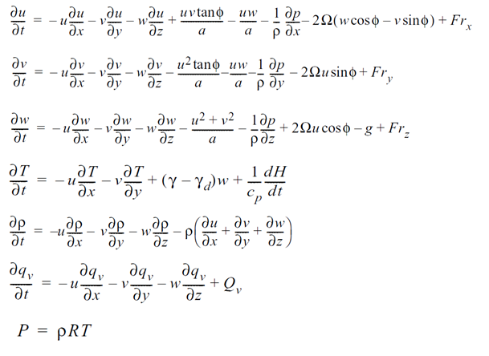
```

\pagebreak

The **momentum equations for a spherical Earth** (1–3) represent Newton's second law of motion, which states that the rate of change of momentum of a body is proportional to the resultant force acting on the body, and is in the same direction as the force.
The **thermodynamic energy equation** (Eq. 4) accounts for various effects, both adiabatic and diabatic, on temperature.
The **continuity equation for total mass** (Eq. 5) states that mass is neither gained nor destroyed, and Eq. 6 is analogous but applies only to water vapour. 
The **ideal gas law** (Eq.7) relates temperature, pressure, and density. 
All variables have their standard meteorological meaning. The independent variables u, v, and w are the Cartesian velocity components, p is pressure, ρ is density, T is temperature, qv is specific humidity, Ω is the rotational frequency of Earth, φ is latitude, a is the radius of Earth, γ is the lapse rate of temperature, γd is the dry adiabatic lapse rate, cp is the specific heat of air at constant pressure, g is the acceleration of gravity, H represents a gain or loss of heat, Qv is the gain or loss of water vapour through phase changes. Fr is a generic friction term in each coordinate direction.
A complete model will also have continuity equations for cloud water, cloud ice, and the different types of precipitation.
The equations are called the **primitive equations**, and models that are based on these equations are called primitive-equation models. This terminology is used to distinguish these models from ones that are based on differentiated versions of the equations, such as the vorticity equation. Virtually all contemporary research and operational models are based on some version of these primitive equations.

### Approximations to the Equations

In reality, since the numerical models are built for various purposes that deal with different scales, it is expected that this set of equations will be simplified with some assumptions. One of the most common assumptions is a hydrostatic approximation.


    • Hydrostatic Approximation
The hydrostatic approximation is a simplification of the equation governing the vertical component of velocity. It simply says that the pressure at any point in the ocean (atmosphere) is due to the weight of the water (air) above it. When vertical accelerations are small compared to the gravitational acceleration, the hydrostatic approximation is valid. Global atmospheric models are hydrostatic, while regional mesoscale models are not hydrostatic.
As with the hydrostatic assumption, the Boussinesq and anelastic approximations are part of a family of approximations that decoupling the pressure and density perturbations. However, their use is not limited to modelling larger horizontal length scales, as is the case with the hydrostatic approximation. Indeed, these approximations are widely used in models of mesoscale or cloud-scale processes.

\pagebreak


    • Boussinesq Approximation
In fluid dynamics, the Boussinesq approximation ignores density differences except where they appear in terms multiplied by g, the acceleration due to gravity. The essence of the Boussinesq approximation is that the difference in inertia is negligible, but gravity is sufficiently strong to make the specific weight appreciably different between the two fluids. Boussinesq flows are common in nature (such as atmospheric fronts, oceanic circulation, katabatic winds). The approximation is exceptionally accurate for many such flows and makes the mathematics and physics simpler.

### Numerical Solutions to the equations

The analytic solution for the set above of equations is impossible. Therefore, numerical methods obtain approximate solutions. Different models use different solution methods. 
Global models often use **spectral methods** for the horizontal dimensions and finite-difference methods for the vertical dimension, while regional models usually use **finite-difference methods** in all three dimensions. For specific locations, model output statistics use climate information, the output from numerical weather prediction, and current surface weather observations to produce statistical relationships which account for model bias and resolution issues. 
Since numerical models commonly deal with part of the universe; **boundary conditions are necessary**. For instance, top and bottom boundary conditions should be given in a global atmospheric model. A regional atmospheric model requires lateral boundary conditions in addition to top and boundary conditions.

\pagebreak

### Physical Parameterizations

The physical processes associated with the radiative transfer, turbulent mixing, convection, clouds, surface exchange, subgrid-scale orographic drag and non-orographic gravity wave drag have a substantial impact on the large scale flow of the atmosphere. However, these **mechanisms are often active at scales smaller than the resolved scales of the model grid**. 
Parametrization schemes are then necessary to adequately describe the impact of these subgrid-scale mechanisms on the large-scale flow of the atmosphere. In other words, the ensemble effect of the subgrid-scale processes has to be formulated in terms of the resolved grid-scale variables. **Parameterization is a method of replacing processes that are too small-scale or complex to be physically represented in the model by a simplified process**. For example, sometimes, we use prescribed values based on some climatology, or we use a simplified version of the process.


```{r Physical Parameterizations, fig.cap='XX)', out.width='80%', fig.asp=.75, fig.align='center',echo=FALSE, fig.show='hold'}
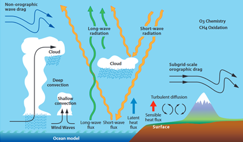
```

### Data Assimilation

One critical step on weather forecasting is data assimilation. Data assimilation is used in NWP. It's defined as the process by which 'optimal' initial conditions for numerical forecasts are defined. The best analysis (initial conditions) is the analysis that leads to the best forecast. Typically, it should take less than 45 minutes on a large high-performance computer.

**Data assimilation has two main goals:**
  1. To make the **best estimate of the initial state** of the atmosphere-land-ocean system out of all available information (model and observations).
  2. To **quantify the uncertainty** of our estimate of the initial state to enable us to initialize an ensemble forecast.

\pagebreak

The weather forecasts produced by operational centers use data assimilation to estimate initial conditions for the forecast model from observations. The quality of forecasts depends on how well we use the information received in real-time from the global observing system.
The purpose of data assimilation is to determine the best possible atmospheric state using observations and short-range forecasts. Data assimilation is typically a **sequential time-stepping procedure**, in which a previous model forecast is compared with newly received observations, the model state is then updated to reflect the observations, a new forecast is initiated, and so on. The update step in this process is usually referred to as the analysis; the short model forecast used to produce the analysis is called the background; we will see this later.

```{r Data Assimilation, fig.cap='XX)', out.width='80%', fig.asp=.75, fig.align='center',echo=FALSE, fig.show='hold'}
knitr::include_graphics('figures/Figure73.png')
```

    • The data assimilation process
Here we have described the data assimilation process:

```{r Data Assimilation 2, fig.cap='XX)', out.width='80%', fig.asp=.75, fig.align='center',echo=FALSE, fig.show='hold'}
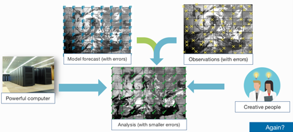
```

1. The data assimilation process requires several elements. We start with a model on-grid. We need to be aware that this model will contain a number of known and unknown errors that we need to estimate and characterize.
2. Next, we also need observations. Sometimes they are only indirectly related to the model; they have errors, they are discontinuous in time and heterogeneous in space and in terms of the observed quantities.
3. Then we will need a computer with powerful CPUs and, equally important, innovative and creative people to produce the analysis. Statistically, the analysis will be more accurate than the preliminary information entered into the system.

\pagebreak

    • The data assimilation cycle
An analysis is not produced by observations alone. **The analysis** at a given time is the result of blending information from a short forecast from the previous analysis time together with information from a fresh batch of observations. The observations are used to correct errors in the short forecast from the previous analysis time. This happens typically every 12 hours, but it could be more frequently to higher-resolution or local area models. From the updated analysis, a short forecast is run to initialize the successive analysis and a long forecast is disseminated to users. **At ECMWF (European centre for medium range weather forecast)**, twice a day, about 25 million observations are used to correct the 150 million variables that define the model's virtual atmosphere. This is done by a four-dimensional adjustment in space and time based on the available observations (4D-Var). This operation takes as much computer power as the 10-day forecast.
The forecast model is a crucial component in modern data assimilation algorithms, as the analysis is a model trajectory. The short-range forecast carries information from past observations into the current analysis. This is called **'background'**. We need a good model to do this job. A good model, starting from accurate previous analysis, will produce an accurate background. The analysis will make only a small correction to the background. When the analysis makes a large correction to the background state, this should alert the forecaster that something interesting is happening, e.g. rapid development that was not present in the forecast or suspect observations. In modern data assimilation methods, the analyses state is constructed to respect the physical and dynamical balances of the model. The model is an integral part of the analysis algorithm.

    • 4D-Var data assimilation method
ECMWF uses a 4D-Var data assimilation method. Around 25 million observations within 12 hours are used simultaneously in one global (iterative) estimation problem. A first guess forecast is run at high resolution (9 km) from the background state at the start of the assimilation window. During this forecast, model equivalents of the observations are computed. 4D-Var adjusts the 12-hour forecast to find the best compromise between the information from the background.

\pagebreak

```{r Data Assimilation 3, fig.cap='XX)', out.width='80%', fig.asp=.75, fig.align='center',echo=FALSE, fig.show='hold'}
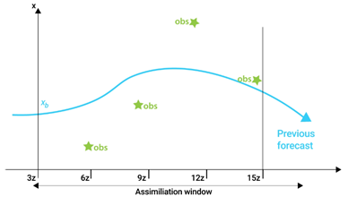
```

```{r Data Assimilation 4, fig.cap='XX)', out.width='80%', fig.asp=.75, fig.align='center',echo=FALSE, fig.show='hold'}
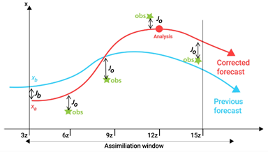
```

### Sources of model error
    • Computer models have inherent flaws that limit the accuracy of weather forecasts (each model makes certain assumptions about the atmosphere).
    • Majority of models are not global in their coverage (errors along the model's boundaries).
    • Regions where observations are sparse.
    • Grid Spacing (resolution) – Parametrization.
    • Many models cannot adequately interpret many of the factors that influence surface weather.
    • Chaos, limit model accuracy.
    • Uncertainties in the data.

\pagebreak

### Ensemble Forecasting

Like we already know, a forecast is an estimate of the future state of the atmosphere. And it is created by estimating the current state of the atmosphere using observations, and then calculating how this state will evolve in time using a numerical weather prediction computer model. 
As the atmosphere is a chaotic system, minimal errors in its initial state can lead to large errors in the forecast. This means that we can never create a perfect forecast system because we can never observe every detail of the atmosphere's initial state. Tiny errors in the initial state will be amplified, so there is always a limit to how far ahead we can predict any detail. To test how these small differences in the initial conditions may affect the outcome of the forecast, an ensemble system can be used to produce many forecasts.

**How we do ensemble forecasts?**

Instead of running just a single forecast, the computer model is run a number of times from slightly different starting conditions. The complete set of forecasts is referred to as the **ensemble** and individual forecasts within it as **ensemble members**.
Ensemble forecast systems are designed so that each member should be equally likely. The initial differences between the ensemble members are small and consistent with uncertainties in the observations. But when we look several days ahead the forecasts can be quite different.

```{r Ensemble Forecasting, fig.cap='XX)', out.width='80%', fig.asp=.75, fig.align='center',echo=FALSE, fig.show='hold'}
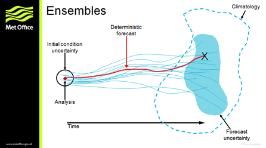
```

Here we have a schematic representation of an ensemble forecast: an ensemble samples the uncertainty of the forecast, assuming that the forecast model is perfect. If the starting conditions were known accurately, and the model was perfect, then an accurate forecast could, in theory, be produced. However, because it is not possible to know the exact starting conditions, we use our best guess and generate a forecast which can sometimes be inaccurate (shown in red in the schematic above). By sampling the uncertainty in the starting conditions, and running several ensemble members forward with the model (shown in blue in the schematic above), we produce an **estimate of the forecast uncertainty** and an indication of which weather events may occur.

\pagebreak

As the forecast goes further and further into the future, the lines look more and more like scrambled spaghetti, which is why an ensemble forecast chart such as this one is often referred to as a **spaghetti plot**. We can assume that the less agreement among the model runs, the less predictable is the weather.

### Other Methods of Weather Forecasting
    • **Persistence Forecast:** 'tomorrow we'll have the same weather as today', which is often quite a good guess for regions with synoptic weather variations. 
    • **Steady-state or Trend Forecast:** surface weather systems move in the same direction and at the same speed as they have been moving.
    • **Analog Method:** e.g. the weather will be analogue to other days when the same situation occurred, like the passing of a cold front.
    • **Statistical Forecasts:** using statistical models, based on climatology.
    • **Weather Type Forecasting:** by categorizing weather patterns, uses analog method.
    • **Climatological forecast:** based on climatology of an area.

### The time range of Forecasts

Until a maximum of six-hour, we perform **nowcasting or very short-range forecast** where we make a description of current weather parameters.
**Short-range weather forecasting** describes beyond 12 hours and up to 72 hours description of weather parameters.
**Medium-range weather forecasting** beyond 3 days and up to 8 days description of weather parameters.
Beyond 8/10 days we enter in the **long-range forecast**. Here we have several categories. We can have, for example, a **monthly outlook** with a description of averaged weather parameters expressed as an anomaly from climate values for that month. Or a **seasonal outlook** is a description of averaged weather parameters expressed as an anomaly from climate values for that season.

\pagebreak

## Climate Modeling

### What is a climate model?

```{r What is a climate model, fig.cap='XX)', out.width='80%', fig.asp=.75, fig.align='center',echo=FALSE, fig.show='hold'}
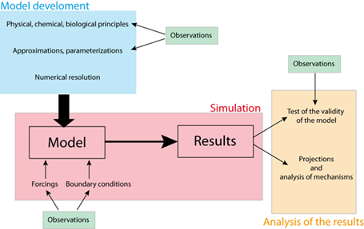
```

A climate model could be defined as a mathematical representation of the climate system based on physical, biological and chemical principles. 
The equations derived from these laws are so complex that they must be solved numerically. As a consequence, climate models provide a solution which is discrete in space and time, meaning that the **results obtained represent averages over regions**, whose size depends on **model resolution**, and for specific times. For instance, some models provide only globally or zonally averaged values, while others have a numerical grid whose spatial resolution could be less than 100 km. The time step could be between minutes and several years, depending on the process studied. Even for models with the highest resolution, the numerical grid is still much too coarse to represent small scale processes such as turbulence in the atmospheric and oceanic boundary layers, the interactions of the circulation with small scale topography features, thunderstorms, cloud microphysics processes. 
Furthermore, many processes are still not sufficiently well-known to include their detailed behavior in models. As a consequence, **parameterizations have to be designed**, based on empirical evidence or theoretical arguments, to account for the large-scale influence of those processes not included explicitly. Because these parameterizations reproduce only the first-order effects and are usually not valid for all possible conditions, they are often a large source of considerable uncertainty in models.
In addition to the **physical, biological and chemical knowledge** included in the **model equations**, climate models require some inputs derived from observations or other model studies. Those model inputs are often separated into **boundary conditions and external forcings** (such as the changes in solar irradiance) which drives the changes in climate. However, those definitions could sometimes be misleading. The forcing of one model could be a key state variable of another. For instance, the changes in CO2 concentration could be prescribed in some models while it is directly computed in models, including a representation of the carbon cycle. In this framework, some data are required as input during the simulation. However, the importance of data is probably even greater during the development phase of the model, as they provide essential information on the properties of the system that is being modelled. In addition, **large numbers of observations are needed to test the validity of the models** in order to gain confidence in the conclusions derived from their results.

\pagebreak

Many climate models have been developed to perform **climate projections**, i.e. to simulate and understand climate changes in response to the emission of greenhouse gases and aerosols. Besides, models can be formidable **tools to improve our knowledge** of the essential characteristics of the climate system and the causes of climate variations. Climatologists cannot perform experiments on the real climate system to identify the role of a particular process clearly or to test a hypothesis. However, this can be done in the virtual world of climate models. For highly nonlinear systems, the design of such tests, often called **sensitivity experiments**, has to be very carefully planned. 

### Types of climate models

Simplifications are unavoidable when designing a climate model as the processes that should be considered, range from the scale of centimetres to that of the Earth itself. The involved time scales also vary widely from the order of seconds for some waves to billions of years when analyzing the evolution of the climate since the formation of Earth. It is thus an important skill for a modeller to be able to select **the processes that must be explicitly included** compared to those that can be neglected or represented in a simplified way. This choice is, of course, based on the scientific goal of the study. However, it also depends on technical issues since the most sophisticated models require a lot of **computational power:** even on the largest computer presently available, the models cannot be routinely used for periods longer than a few centuries to millennia. 
On longer time scales, or when quite a large number of experiments are needed, it is thus necessary to use **simpler and faster models**. Furthermore, it is often very illuminating to deliberately design a model that includes only the most important properties, to understand in-depth the nature of feedback or the complex interaction between the various components of the system. This is also the reason why **simple models are often used to analyze the results of more complex models** in which the fundamental characteristics of the system could be hidden by the number of processes represented and the details provided. Modellers have first to decide the variables or processes to be considered and those that will be taken as constants. This provides a method of classifying the models as a function of the components that are represented interactively. 
A second way of **differentiating between models is related to the complexity of the processes** that are included. At one end of the spectrum, **General Circulation Models (GCMs) and Earth Systems Models** try to account for all the essential properties of the system at the highest affordable resolution. At the other end of the spectrum, **simple climate models (such as the Energy Balance Models EBMs)**, propose a highly simplified version of the dynamic of the climate system. The variables are averaged over large regions, sometimes over the whole Earth, and many processes are not represented or accounted for by the parameterizations. **Earth Models of Intermediate Complexity** are located between those two extremes. They are based on a more complex representation of the system than EBMs but include simplifications and parameterizations for some processes that are explicitly accounted for in GCMs.

\pagebreak

When employed correctly, all the model types can produce useful information on the behaviour of the climate system. There is **no perfect model suitable for all purposes.** This is why a wide range of climate models exists, forming what is called the spectrum or the hierarchy of models. Depending on the objective or the question, one type of models could be selected. The best type of model to use depends on the objective or the question. On the other hand, combining the results from various types of models is often the best way to gain a deep understanding of the dominant processes in action.

#### Energy Balance Models

Starting with Energy balance models, which the simplest possible conceptual models form modelling Earth's climate.
An Energy Balance Model does not attempt to resolve the dynamics of the climate system, i.e., large-scale wind and atmospheric circulation systems, ocean currents, convective motions in the atmosphere and ocean, or any number of other basic features of the climate system. Instead, it merely focuses on the energetics and thermodynamics of the climate system. 

    • Zero Dimensional EBM
    
```{r Energy Balance Models, fig.cap='XX)', out.width='80%', fig.asp=.75, fig.align='center',echo=FALSE, fig.show='hold'}
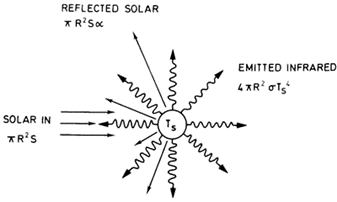
```

The Zero Dimensional EBM—the simplest model that can be invoked to explain, for example, the average surface temperature of the Earth. In this straightforward model, the Earth is treated as a mathematical point in space—that is to say, there is no explicit accounting for latitude, longitude, or altitude. Hence, we refer to such a model as 'zero-dimensional'. In the zero-dimensional EBM, we solve only for the balance between incoming and outgoing sources of energy and radiation at the surface.

\pagebreak

    • Gray Body Variant
    
```{r Energy Balance Models 2, fig.cap='XX)', out.width='80%', fig.asp=.75, fig.align='center',echo=FALSE, fig.show='hold'}
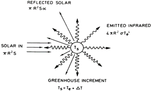
```

We add up a little bit more complexity, considering the effect of the Earths atmosphere particulary, the impact of the atmospheric greenhouse effect—through use of the so-called 'gray body' variant of the EBM.

#### Earth Models of Intermediate Complexity (EMIC)

EMICs involve some simplifications, but they always include a representation of the Earth's geography, i.e. they provide more than averages over the whole Earth or large boxes. Secondly, they include many more degrees of freedom than EBMs. As a consequence, the parameters of EMICs cannot easily be adjusted to reproduce the observed characteristics of the climate system, as can be done with some simpler models.
The level of approximation involved in the development of the model varies widely between different EMICs. Some models use a very simple representation of the geography, with a zonally averaged representation of the atmosphere and ocean. As the atmospheric and oceanic circulations are fundamentally three-dimensional, some parameterizations of the meridional transport are required. 
On the other hand, some EMICs include components that are very similar to those developed for GCMs, although a coarser numerical grid is used so that the computations proceed fast enough to allow a large number of relatively long simulations to be run. Some other components are simplified, usually including the atmosphere because this is the component that is mostly depending on computer time in coupled climate models.

\pagebreak


#### General Circulation Models

GCMs attempt to describe the full 3D geometry of the atmosphere and other components of Earth's climate system. Atmospheric GCMs numerically solve the equations of physics (e.g., dynamics, thermodynamics, radiative transfer, etc.) and chemistry applied to the atmosphere and its constituent components, including the greenhouse gases.
Current generation climate models typically include an ocean that plays a far more active role in the climate system. The major current systems are modeled, as is their direct role in transporting heat poleward. When the dynamics of the ocean and its interactions with the atmosphere are explicitly resolved by a climate model, the model is referred to as Atmosphere-Ocean GCM, or AOGCM, or sometimes merely a coupled model.

```{r General Circulation Models, fig.cap='XX)', out.width='80%', fig.asp=.75, fig.align='center',echo=FALSE, fig.show='hold'}
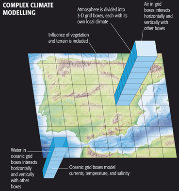
```

\pagebreak

#### Earth system models 

Earth system models (ESM) seek to simulate all relevant aspects of the Earth system. They include physical, chemical and biological processes, therefore reaching far beyond their predecessors, the global climate models (GCM), which just represented the physical atmospheric and oceanic processes.
The climate system is driven by more than the physical processes that have conventionally been modelled (such as winds, clouds, land surface, oceans and ice). The concentration of greenhouse gases and aerosols are not only affected by human-made emissions, as these are involved in physical reactions and interactions with the biological components of the Earth system, strongly linked to the climate system.

```{r Earth system models, fig.cap='XX)', out.width='80%', fig.asp=.75, fig.align='center',echo=FALSE, fig.show='hold'}
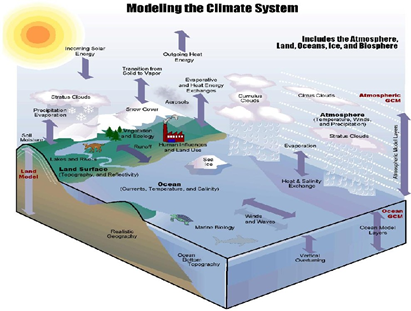
```

    • The basic structure of an Earth System Model
Here we have the basic structure of an Earth System Model: blue boxes represent the processes included in a climate model; green boxes represent the additional components that may be included in an Earth System Model.
At their core ESMs have the atmospheric and ocean components of a GCM however to this they add representations of the global carbon cycle, dynamic vegetation, atmospheric chemistry, ocean bio-geo-chemistry and even continental ice sheets.
	
\pagebreak

```{r Earth system models 2, fig.cap='XX)', out.width='80%', fig.asp=.75, fig.align='center',echo=FALSE, fig.show='hold'}
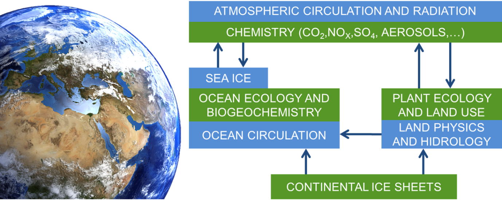
```	

    • Key features of climate models and earth system models
The earth system models gain complexity by considering the biological and chemical processes. Instead of using predetermined inputs of atmospheric composition such as aerosols and greenhouse gases, an ESM can simulate how these components change over time in response to anthropogenic activity and changing climate conditions. ESMs are therefore able to represent human influence on climate more completely, e.g. by deforestation and greenhouse gases emissions.
ESMs are composed by a set of equations describing atmospheric and oceanic circulation and thermodynamics, but also the biological and chemical processes that feedback on to the physics of climate; all solved for several locations in space that form a three-dimensional grid over the surface of the Earth and underneath the surface of the oceans Merging all climate-relevant aspects together in a single model is computationally very demanding and time-consuming.


```{r Earth system models 3, fig.cap='XX)', out.width='80%', fig.asp=.75, fig.align='center',echo=FALSE, fig.show='hold'}
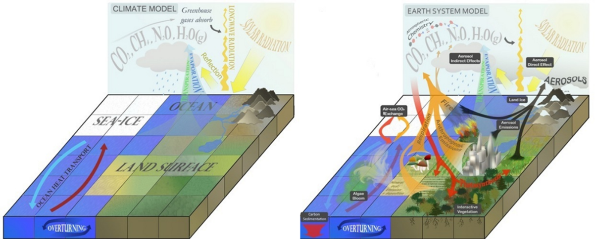
```	


  
