\mainmatter

# (PART) Weather and climate systems {-}

# Global climate & Köppen classification {#intro}
\chaptermark{Intro}

## Definitions

**Microclimate:** climate at small scales (leaf, forest) (see lecture 9).
**Mesoclimate:** between microclimate and macroclimate. This idevision is a quite arbitrary (regional).
**Macroclimate:** large scale climate (e.g. Europe).
**Global climate:** climate at planetary scale.

## Climatic controls

```{r Climatic controls, fig.cap='caption', out.width='80%', fig.asp=.75, fig.align='left',echo=FALSE, fig.show='hold'}
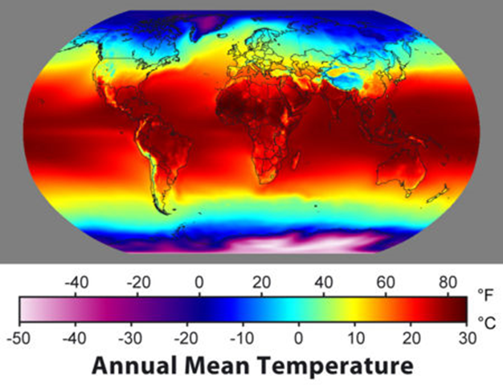
```

Seven key factors are determining the climate type on each location on earth:

1. Latitude
2. Distribution of land and water => continental or maritime (heat capacity of water)
3. Ocean currents (e.g.temperate climate in Europe due to the gulf stream)  
4. Dominant wind direction  (e.g. westerlies for Belgian weather)
5. Position of dominant high and low pressure zones (e.g. Azores H, Icelandic L)
6. Mountain ranges orientation (e.g. east west oriented mountains in Europe: Alps, Pyrenees)
7.Altitude (Himalaya in map above)

\pagebreak

## Global precipitation

Global precipitation patterns are determined by the 3 cell model of global circulation. Wet regions at low pressure zones of the equator (ITCZ), and around 60° north or south.  Very dry areas at the high pressure latitudes of 30° north and south and the poles. In between these wet and dry areas there are precipitation gradients.

```{r Global precipitation, fig.cap='caption', out.width='80%', fig.asp=.75, fig.align='left',echo=FALSE, fig.show='hold'}
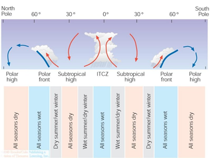
```

In addition, we need to account fort he orografic cloud formation and precipitation patterns that are linked to topography. In the figure below the precipitation pattern can perfectly be linked to the west-east topography in California.

```{r Global precipitation 2, fig.cap='caption', out.width='80%', fig.asp=.75, fig.align='left',echo=FALSE, fig.show='hold'}
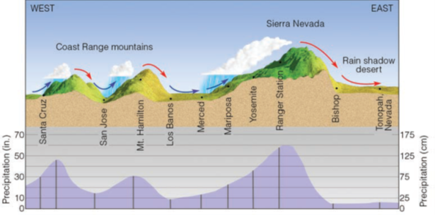
```

\pagebreak

## Climate classification – Köppen system

The factors described in section 8.2 and 8.3 determine the global spatial distribution of climate types, which has been summarize in the Köppen climate classification. The Köppen clasiification is based on latitude (tropical, temperate, polar), the average temperature, precipitation (e.g. tropical wet vs. tropical dry) and topography (highland climate type). It has a letter code with 6 main climate types (capital letters) and a series of sub-types (small letters). See table 17.1 I the book Meteorology Today for an overview.

```{r Climate classification, fig.cap='caption', out.width='80%', fig.asp=.75, fig.align='left',echo=FALSE, fig.show='hold'}
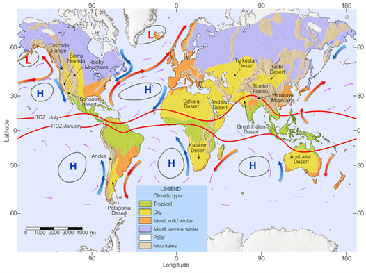
```

```{r Climate classification 2, fig.cap='caption', out.width='80%', fig.asp=.75, fig.align='left',echo=FALSE, fig.show='hold'}
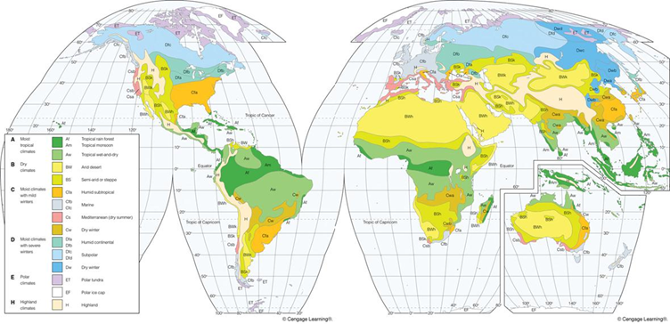
```

\pagebreak

## Vegetation zones

There is a clear link between climate types and vegetation types/zones.

```{r Vegetation zones, fig.cap='caption', out.width='80%', fig.asp=.75, fig.align='left',echo=FALSE, fig.show='hold'}
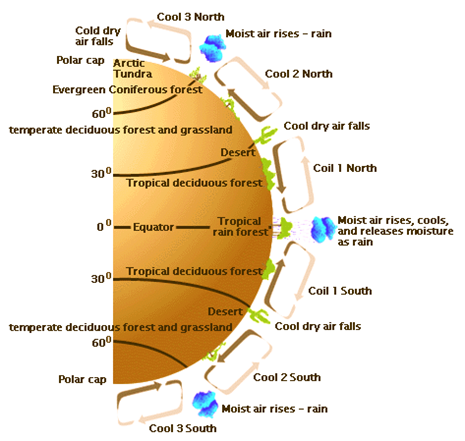
```

```{r Vegetation zones 2, fig.cap='caption', out.width='80%', fig.asp=.75, fig.align='left',echo=FALSE, fig.show='hold'}
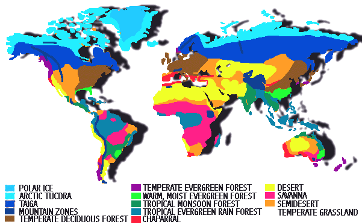
```

\pagebreak

```{r Vegetation zones 3, fig.cap='caption', out.width='80%', fig.asp=.75, fig.align='left',echo=FALSE, fig.show='hold'}
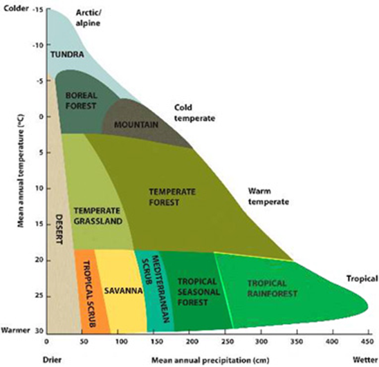
```

In the above figure the global biomes are situated on a temperature-precipitation plot. Remark that Tundra systems are very dry (very low annual precipitation), but they typically have very wet landscapes (ponds, lakes, …) due to the very low evaporation. These two axis allow to roughly determine the climax vegetation expected in a certain region. But of course the actual climax vegetation type is also depending on soil type, local climate. And for the actual vegetation management, disturbance (fires), grazing, … play an important role too.  

\pagebreak

```{r Vegetation zones 4, fig.cap='caption', out.width='80%', fig.asp=.75, fig.align='left',echo=FALSE, fig.show='hold'}
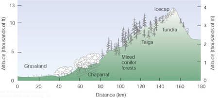
```

On mountain slopes, vegetation zones can be found at very short distance.

```{r Vegetation zones 5, fig.cap='caption', out.width='80%', fig.asp=.75, fig.align='left',echo=FALSE, fig.show='hold'}
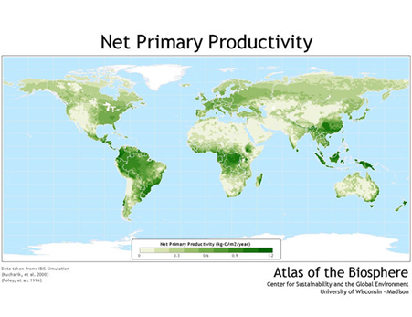
```

Not only the vegetation type but also vegetation functioning can be linked to global climate patterns. For example the map above shows the vegetation productivity (NPP). The global NPP patterns can clearly be linked to global temperature and precipitation patterns: precipitation will be limiting in the Sahara, and temperature will be limiting towards the North pole. 

\pagebreak

```{r Vegetation zones 6, fig.cap='caption', out.width='80%', fig.asp=.75, fig.align='left',echo=FALSE, fig.show='hold'}
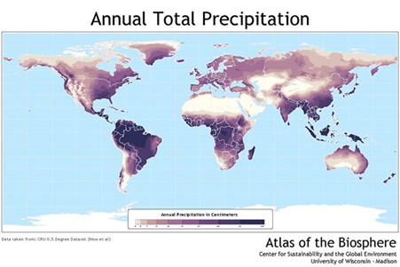
```

```{r Vegetation zones 7, fig.cap='caption', out.width='80%', fig.asp=.75, fig.align='left',echo=FALSE, fig.show='hold'}
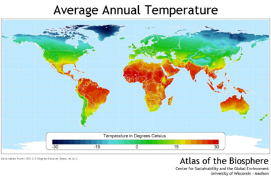
```


