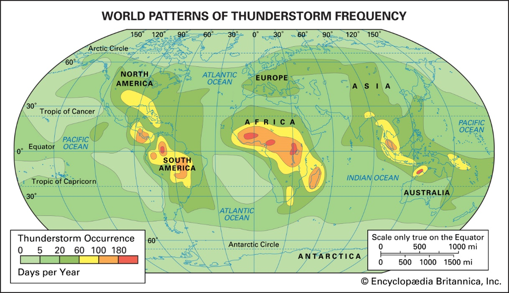
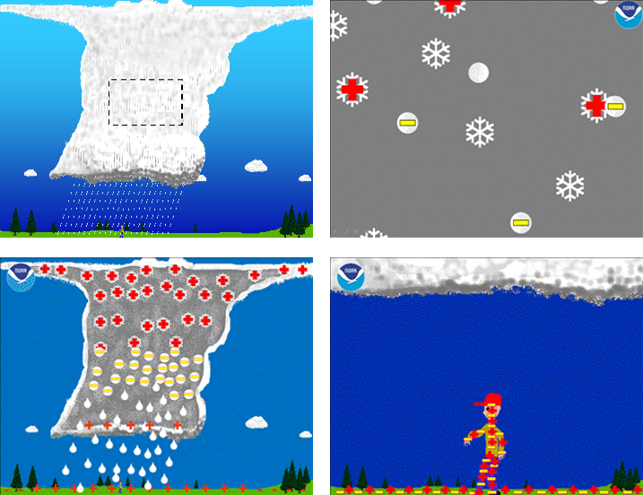

\mainmatter

# (PART) Extra Chapter {-}

# Extreme events: storms, tornadoes and hurricanes {#intro}
\chaptermark{Intro}

# Introduction – Why studying extreme events?

Climate describes how the atmosphere behaves over a long period of time, (typically defined as at least 30 years), informing us on the “average of the weather”, as well as the description of other aspects of weather patterns and meteorological parameters’ distribution, including anomalous, rare and extreme events.
Some examples of extreme weather or climate events include, but are not limited to, heat waves, cold waves, floods (which are often associated with extreme precipitation events), droughts and wildfires. And of course, we also have, thunderstorms, tornadoes and hurricanes where we are focusing our attention in this chapter.
We know that some of these extreme weather events do not occur often. **Why do we need to focus our attention on this phenomena?**Still, they can have the most marked impacts: causing significant devastation to infrastructure, affecting our economy and health, and often resulting in the loss of life. It is essential for meteorological communities to improve the understanding and characterization of extreme weather and climate events in time and space with regionally and globally consistent methodologies. Meteorologists continue to study better systems for monitoring or even forecasting these events because they are essential as part of building resilient societies able to cope with climate variability and adapt to climate change.

# Thunderstorms

## Thunderstorm formation and structure

A **thunderstorm** is a violent short-lived weather disturbance that is almost always associated with lightning, thunder, dense clouds, heavy rain or hail, and strong gusty winds. 
Thunderstorms arise when layers of warm, moist air rise in a large, swift updraft to colder regions of the atmosphere. There the moisture contained in the updraft condenses to form towering cumulonimbus clouds and, eventually, precipitation. Columns of cooled air then sink earthward, striking the ground with strong downdrafts and horizontal winds. At the same time, electrical charges accumulate on cloud particles. Lightning discharges occur when the accumulated electric order becomes sufficiently large. On occasion, severe thunderstorms are accompanied by swirling vortices of air that become concentrated and powerful enough to form tornadoes.

\pagebreak

Here we have a schematic representation of thunderstorm formation and structure. 

```{r Thunderstorm formation, fig.cap='caption', out.width='80%', fig.asp=.75, fig.align='left',echo=FALSE, fig.show='hold'}

```

Thunderstorms are convective storms. In technical terms, a thunderstorm is said to develop when the atmosphere becomes “unstable to vertical motion”. Such instability can arise whenever relatively warm; light air is overlain by colder, heavier air. Under such conditions the colder air tends to sink, displacing the warmer air upward. If a sufficiently large volume of air rises, an updraft will be produced. If the updraft is moist, the water will condense and form clouds; condensation, in turn, will release latent heat, further fueling upward air motion and increasing the instability. Once upward air motions are initiated in an unstable atmosphere, rising parcels of warm air accelerate as they rise through their colder surroundings because they have a lower density and are more buoyant. This motion can set up a pattern of convection wherein heat and moisture are transported upward, and colder and drier air is transported downward. Areas of the atmosphere where vertical motion is relatively strong are called cells, and when they carry air to the upper troposphere, they are called deep cells. 
Thunderstorms develop when deep cells of moist convection become organized and merge, and then produce precipitation and ultimately lightning and thunder. The enormous clouds associated with thunderstorms typically start as isolated cumulus clouds that develop vertically into domes and towers. If there is enough instability and moisture and the background winds are favourable, the heat released by condensation will further enhance the buoyancy of the rising air mass. Ultimately, a cumulonimbus cloud will form, with its characteristic anvil-shaped top, billowing sides, and dark base. Cumulonimbus clouds typically produce large amounts of precipitation.

\pagebreak

## Types of thunderstorms

### Ordinary cell thunderstorms

```{r Ordinary cell thunderstorms, fig.cap='caption', out.width='80%', fig.asp=.75, fig.align='left',echo=FALSE, fig.show='hold'}

```

The thunderstorms were classified according to the characteristics of the storms themselves, and such features depend mainly on the meteorological environment in which the storms develop.
**Isolated thunderstorms or Ordinary Cell thunderstorms** tend to occur where there are light winds that do not change dramatically with height and where there is abundant moisture at low and middle levels of the atmosphere. These storms are sometimes called air-mass or local thunderstorms. They are mostly vertical in structure, are relatively short-lived, and usually do not produce violent weather at the ground. They presented a well-defined life cycle.
The first stage is known as the **cumulus stage, or growth stage** - As a parcel of warm, humid air rises, it cools and condenses into a single cumulus cloud or a cluster of clouds. The cloud continues to grow in an unstable atmosphere as long as it is continuously fed by rising air from below. As the cloud builds well above the freezing level, the cloud particles collide and join with one another and thus grow larger and heavier. This liquid and solid (ice) particles continue to rise until the size of the growing particles exceeds the ability of the updraft to keep them suspended – beginning of **mature stage** - The downdraft and updraft within the mature thunderstorm now constitute the cell. Lightning and thunder are also present in the mature stage. Heavy rain (and occasionally small hail) often falls from the cloud. Where the cold downdraft reaches the surface, the air spreads out horizontally in all directions: gust fronts. The **dissipating stage** occurs when the updrafts weaken as the gust front moves away from the storm and no longer enhances the updrafts.

\pagebreak

### Multicell thunderstorms

```{r Multicell thunderstorms, fig.cap='caption', out.width='80%', fig.asp=.75, fig.align='left',echo=FALSE, fig.show='hold'}

```

Another type of thunderstorm associated with the most severe weather is the multicell thunderstorms. They are characterized by several updrafts and downdrafts close to one another. They occur in clusters of cells in various stages of development, moving together as a group.
Because these storms developed in areas with strong wind shear, the updraft tend to ride up over downdraft movements. Precipitation inside the storm does not fall into the updraft so the storm’s fuel supply is maintained and the storm complex can survive for a long time. 

    • **Downdrafts and Gust Fronts**
Originate at altitudes where the air temperature is colder than at ground level, and they are kept cold even as they sink to warmer levels by the evaporation of water and melting of ice particles. Not only is the sinking air denser than its surroundings, but it carries a horizontal momentum that is different from the surrounding air. When such air hits the ground, it usually moves outward ahead of the storm at a higher speed than the storm itself. This is why an observer on the ground watching a thunderstorm approach can often feel a gust of cold air before the storm passes overhead. The passage of such a gust front is easily recognized as the wind speed increases, and the air temperature suddenly drops.

    • **Downbursts**
Beneath an intense thunderstorm, the downdraft can become localized so that it hits the ground and spreads horizontally in a radial burst of wind, much like water pouring from a tap and striking the sink below. Such downdrafts are called downbursts.

    • **Mesoscale Convective System (MCS)**
Sometimes a collection of thunderstorms reunited together and act as a system – we call this Mesoscale Convective System, because of their size and duration who last more than 12 hours. Here in this radar measurements (slide 14), we have Mesoscale convective complex where storms organize into a large, circular convective weather system. MCV are thunderstorms organized into a region cyclonic rotation.

    • **Squall-Line Thunderstorms**
A squall-line is also a Mesoscale Convective System organized as a line of thunderstorms. A squall is a violent burst of wind normally associated with significant thunder, hail and rain. It lasts for at least one minute. Wind gust: wind strength increases for a few seconds. A squall is caused by updrafts that produce storm clouds and downdrafts that hit the ground and quickly move ahead from the storm (similar as gust fronts), the warm air before this front is forced upwards and is feeding the storm, so it is self-sustaining. A squall-line is a stretch of violent winds that rises en masse, normally developing ahead of, or along a cold front. It is 100 km long and the structure last for several hours.

\pagebreak

### Supercell thunderstorms

```{r Supercell thunderstorms, fig.cap='caption', out.width='80%', fig.asp=.75, fig.align='left',echo=FALSE, fig.show='hold'}

```

These storms are the most intense type of thunderstorm. Supercells typically have a broad, intense updraft. The updraft rises rotate counterclockwise, forming an anvil. Updraft speeds in supercell storms can exceed 40 metres per second and are capable of suspending hailstones as large as grapefruit. Supercells can last two to six hours. They are the most likely storm to produce spectacular wind and hail damage as well as powerful tornadoes.

## Distribution of thunderstorms

Thunderstorms occur most often in the tropical latitudes over land, where the air is most likely to heat quickly and form strong updrafts.

```{r Distribution of thunderstorms, fig.cap='caption', out.width='80%', fig.asp=.75, fig.align='left',echo=FALSE, fig.show='hold'}

```

\pagebreak

## Thunderstorm electrification

### Electrification of Clouds

```{r Electrification of Clouds, fig.cap='caption', out.width='80%', fig.asp=.75, fig.align='left',echo=FALSE, fig.show='hold'}

```

While the exact details of the charging process are still being studied, scientists generally agree on some of the basic concepts of thunderstorm electrification. 
The main charging area in a thunderstorm occurs in the central part of the storm where air is moving upward rapidly (updraft) and temperatures range from -15 to -25 Celsius (Panel 1 in figure above). At that place, the combination of temperature and rapid upward air movement produces a mixture of super-cooled cloud droplets (small water droplets below freezing), small ice crystals, and soft hail (graupel). The updraft carries the super-cooled cloud droplets and very small ice crystals upward. At the same time, the graupel, which is considerably larger and denser, tends to fall or be suspended in the rising air. The differences in the movement of the precipitation cause collisions to occur. When the rising ice crystals collide with graupel, the ice crystals become positively charged, and the graupel becomes negatively charged (Panel 2 in figure above).
The updraft carries the positively charged ice crystals upward toward the top of the storm cloud. The larger and denser graupel is either suspended in the middle of the thunderstorm cloud or falls toward the lower part of the storm. The result is that the upper part of the thunderstorm cloud becomes positively charged while the middle to the lower part of the thunderstorm cloud becomes negatively charged (Panel 3 in the figure above).
The upward motions within the storm and winds at higher levels in the atmosphere tend to cause the small ice crystals (and positive charge) in the upper part of the thunderstorm cloud to spread out horizontally some distance from the thunderstorm cloud base. This part of the thunderstorm cloud is called the anvil. While this is the main charging process for the thunderstorm cloud, some of these charges can be redistributed by air movements within the storm (updrafts and downdrafts). In addition, there is a small but important positive charge build-up near the bottom of the thunderstorm cloud due to the precipitation and warmer temperatures.
The charges on the ground are influenced by the charge build-up in the clouds. Normally, the ground has a slight negative charge, however, when a thunderstorm is directly overhead, the large negative charge in the middle of the storm cloud repels negative charges on the ground underneath the storm. This causes the ground and any objects (or people) on the ground directly underneath the storm to become positively charged (Panel 4).
As the negative charge in the cloud increases, the ground responds by becoming more positively charged. Similarly, the positive charge in the anvil can cause a negative charge to build upon the ground under the anvil (which may extend far from the thunderstorm base).

\pagebreak

### Lightning Types
    • Cloud-to-ground lightning
    • Intra-cloud lightning (2/3 of all lighting)
    • Transient Luminous Events (e.g. blue jets)

# Tornadoes

## Typical Stages of Evolution

Five phases typically describe the life cycle of a tornado.
First of all, we start to see the **dust spiraling** on the surface, and we can see a small funnel extends from the cloud. Second, **wind increase over the extended funnel**. After this process, we have a **formed tornado**, and that’s when we have the most severe, funnel the greatest width and almost vertical. Finally, tornado starts **shrinking** and **decay**, where funnel stretched into the shape of a rope.

## Tornado occurrence and distribution

But where tornadoes occur? Well, they have reported tornadoes in all continents except Antarctica. But usually, the occurred in mid-latitude areas where cold polar air meets warm tropical air. However, USA reported 75% of all tornadoes every year, and they mainly occur as you can see on a specific corridor known as Tornado Alley.

```{r Tornado occurrence and distribution, fig.cap='caption', out.width='80%', fig.asp=.75, fig.align='left',echo=FALSE, fig.show='hold'}

```

\pagebreak

## Tornado Intensity

### Enhanced Fujita Scale

Tornado intensity is not estimated directly from measured wind speeds, because tornadoes rarely pass near meteorological instruments. Instead, it is commonly assessed by analyzing the damage to structures and then correlating that damage with the wind speeds required to produce such destruction. This method is essential to assigning tornadoes specific values on the Enhanced Fujita Scale, or EF-Scale, of tornado intensity.
A tornado’s intensity varies along its path, with the most extreme damage usually being restricted to a small area, and the overall EF-Scale value assigned represents the tornado’s highest attained intensity. Once the degree of damage to structures and vegetation has been assessed and matched with the appropriate EF-Scale value, the maximum wind velocities within the range associated with the EF-Scale value are assigned.

## Tornado Formation

### Supercell Tornadoes

```{r Supercell Tornadoes, fig.cap='caption', out.width='80%', fig.asp=.75, fig.align='left',echo=FALSE, fig.show='hold'}

```

```{r Supercell Tornadoes 2, fig.cap='caption', out.width='80%', fig.asp=.75, fig.align='left',echo=FALSE, fig.show='hold'}

```

We do know that tornadoes develop within thunderstorms and that a conditionally unstable atmosphere is essential for their development. Most often, tornadoes form with supercell thunderstorms in an environment with strong vertical wind shear.
Tornadoes that form with supercell thunderstorms are called supercell tornadoes.

\pagebreak

This figure illustrates this updraft and the pattern of precipitation associated with the storm. Notice that as warm, humid air is drawn into the supercell, it spins counterclockwise as it rises. Near the top of the storm, strong winds push the rising air to the northeast. Heavy precipitation falling northeast of the updraft mixes with drier air. Evaporative cooling chills the air. The heavy rain-chilled air then descends as a strong downdraft called the forward-flank downdraft. The separation of the updraft from the downdraft means that the downdraft is unable to fall into the updraft and suppress it. This is why the storm can maintain itself as a single entity for hours.

**So what is it that starts the air rotating? (tornadogenesis)**
The existence of a vertical wind shear causes the air near the surface to rotate about a horizontal axis much like a pencil would rotate around its long axis. Such horizontal tubes of spinning air are called vortex tubes.
If the strong updraft of a developing thunderstorm should tilt the rotating tube upward and draw it into the storm, as illustrated in figure, the tilted rotating tube then becomes a rotating air column inside the storm. The rising, spinning air is now part of the storm’s structure called the mesocyclone (an area of lower pressure a small cyclone) perhaps 5 to 10 kilometres across.

```{r Supercell Tornadoes 3, fig.cap='caption', out.width='80%', fig.asp=.75, fig.align='left',echo=FALSE, fig.show='hold'}

```

### Nonsupercell Tornadoes

Tornadoes that do not occur in association with a mid-level mesocyclone (or a preexisting wall cloud) of a supercell are called non-supercell tornadoes. These tornadoes may occur with intense multicell storms as well as with ordinary cell thunderstorms, even relatively weak ones. Some non-supercell tornadoes extend from the base of a thunderstorm, whereas others may begin on the ground and build upwards in the absence of a condensation funnel.
A waterspout is a rotating column of air that is connected to a cumuliform cloud over a large body of water. A land sprout is a weak, short-lived tornadoes will occur with rapidly building cumulus congestus clouds.

\pagebreak

# Tropical Cyclones

**What is the difference between hurricanes, typhoons and cyclones?**

A tropical cyclone is an intense circular storm that originates over warm tropical oceans and is characterized by low atmospheric pressure, intense winds, and heavy rain. Drawing energy from the sea surface and maintaining its strength as long as it remains over warm water, a tropical cyclone generates winds that exceed 119 km per hour. Usually, accompanying these strong winds are torrential rains and a devastating phenomenon known as the storm surge, which will be explained below, but essentially consists of an elevation of the sea surface above normal levels. Such a combination of high winds and water makes cyclones a severe hazard to coastal areas in tropical and subtropical regions of the world. 
**It’s very common to us hearing several confusing terms sometimes: like hurricane, typhoon and cyclone. But what’s the actual difference between these phenomena?** Well, the short answer is non; all these different names refer to the same type of storm and describe the same physical process.Tropical cyclones are known by various names in different parts of the world. In the North Atlantic Ocean and the eastern North Pacific, they are called hurricanes, and in the western North Pacific around the Philippines, Japan, and China the storms are referred to as typhoons. In the west of South Pacific and the Indian Ocean, they are variously referred to as severe tropical cyclones, tropical cyclones, or simply cyclones.

```{r Tropical Cyclones, fig.cap='caption', out.width='80%', fig.asp=.75, fig.align='left',echo=FALSE, fig.show='hold'}

```

## Anatomy of a tropical cyclone

Tropical cyclones are circular storms, whose winds swirl around a central region of low atmospheric pressure. The winds are driven by this low-pressure core and by the rotation of Earth, which deflects the path of the wind through a phenomenon known as the Coriolis force. As a result, tropical cyclones rotate in a counterclockwise (or cyclonic) direction in the Northern Hemisphere and in a clockwise (or anticyclonic) direction in the Southern Hemisphere.
The wind field of a tropical cyclone may be divided into three regions.
We have the eye. A characteristic feature of tropical cyclones is the eye, a central region of clear skies, warm temperatures, and low atmospheric pressure (<950 mbar). Horizontal winds within the eye, on the other hand, are light. In addition, there is a weak sinking motion, or subsidence, as air is pulled into the eyewall at the surface. As the air subsides, it compresses slightly and warms, so that temperatures at the centre of a tropical cyclone are some 5.5 °C higher than in other regions of the storm. Because warmer air can hold more moisture before condensation occurs, the eye of the cyclone is generally free of clouds. 

\pagebreak

Secondly, we have the eyewall. The most dangerous and destructive part of a tropical cyclone is the eyewall. Here winds are strongest, rainfall is heaviest, and deep convective clouds rise from close to Earth’s surface to a height of 18 km. The high winds are driven by rapid changes in atmospheric pressure near the eye, which creates a large pressure gradient force.
In addition to deep convective cells surrounding the eye, there are often secondary cells arranged in bands around the centre. These bands, commonly called rainbands, spiral into the centre of the storm. In some cases, the rainbands are stationary relative to the centre of the moving storm. In other cases, they seem to rotate around the centre as a tropical cyclone makes landfall, surface friction increases, which in turn increases the convergence of airflow into the eyewall and the vertical motion of air occurring there. The increased convergence and rising of moisture-laden air is responsible for the torrential rains associated with tropical cyclones.

```{r Anatomy of a tropical cyclone, fig.cap='caption', out.width='80%', fig.asp=.75, fig.align='left',echo=FALSE, fig.show='hold'}

```

## Life of a tropical cyclone

### The “right ingredients”
    • The temperature of the surface layer of ocean water must be 26.5 °C or warmer, and this warm layer must be at least 20/50 m deep. 
    • A preexisting atmospheric circulation must be located near the surface.
    • The atmosphere must cool quickly enough with height to support the formation of deep convective clouds (instability).
    • The middle atmosphere must be relatively humid at the height of about 5,000 m above the surface.
    • The developing system must be at least 500 km away from the Equator.
    • The wind speed must change slowly with height through the troposphere.

\pagebreak

### The developing storm

Like expressed in the picture below, the fuel for a tropical cyclone is provided by a transfer of water vapour and heat from the warm ocean to the overlying air, primarily by evaporation from the sea surface. As the warm, moist air rises, it expands and cools, quickly becoming saturated and releasing latent heat through the condensation of water vapour. The column of air in the core of the developing disturbance is warmed and moistened by this process. The temperature difference between the warm, rising air and the cooler environment causes the rising air to become buoyant, further enhancing its upward movement. The vertical motion of warm air is by itself inadequate to initiate the formation of a tropical system. However, if the warm, moist air flows into a preexisting atmospheric disturbance, further development will occur. As the rising air warms the core of the disturbance by both releases of latent heat and direct heat transfer from the sea surface, the atmospheric pressure in the centre of the disturbance becomes lower. The decreasing pressure causes the surface winds to increase, which in turn increases the vapour and heat transfer and contributes to further rising of air. The warming of the core and the increased surface winds thus reinforce each other in a positive feedback mechanism **(Formation)**.

The dynamics of a tropical cyclone rely on the exterior of a storm being cooler than its core, so it is necessary that the temperature of the atmosphere drop sufficiently rapidly with height. The warm, saturated air rising in the centre of the circulation tends to keep rising as long as the surrounding air is cooler and heavier. This vertical movement allows deep convective clouds to develop. If this external air is relatively humid, the circulation will continue to intensify. A final requirement for the intensification of tropical cyclones is that there must be little change in the wind speed with height above the surface. If the winds increase too much with altitude, the core of the system will no longer be vertically aligned over the warm surface that provides its energy. **(Intensification)**.

Finally, tropical cyclones dissipate when they can no longer extract sufficient energy from warm ocean water. As mentioned above, a tropical cyclone can contribute to its own demise by stirring up deeper, cooler ocean waters. In addition, a storm that moves over land will abruptly lose its fuel source and quickly lose intensity. **(Dissipation)**.

\pagebreak

```{r developing storm, fig.cap='caption', out.width='80%', fig.asp=.75, fig.align='left',echo=FALSE, fig.show='hold'}

```

### Stages of development

Hurricanes go through a set of stages from birth to death. 

Initially, a **tropical disturbance** shows up as a mass of thunderstorms with only slight wind circulation. The tropical disturbance becomes a **tropical depression** when the winds increase to between 37 and 63 km/h, and several closed isobars appear about its centre on a surface weather map. When the isobars are packed together, and the winds are between 65 and 117 km/h, the tropical depression **becomes a tropical storm**. If the sustained winds reach 118 km/h, the tropical storm is classified as a **hurricane**. 

A tropical cyclone that remains over the ocean and moves into higher latitudes will change its structure and become extratropical as it encounters colder water. The transformation from a tropical to an extratropical cyclone is marked by an increase in the storm’s diameter and by a change in shape from circular to comma- or v-shaped as its rainbands reorganize. An extratropical cyclone typically has a higher central pressure and consequently has lower wind speeds. Extratropical storms, which are fueled by a north-to-south variation of temperature, weaken and dissipate in a few days.

\pagebreak

```{r Stages of development, fig.cap='caption', out.width='80%', fig.asp=.75, fig.align='left',echo=FALSE, fig.show='hold'}

```

## Location and patterns of tropical cyclones

```{r Location and patterns of tropical cyclones, fig.cap='caption', out.width='80%', fig.asp=.75, fig.align='left',echo=FALSE, fig.show='hold'}

```

Like we can see in this first map and considering the previous slides we can affirm that almost 90% of these storms form within 20° north or south of the Equator. Poleward of those latitudes, sea surface temperatures are too cool to allow tropical cyclones to form, and mature storms moving that far north or south will begin to dissipate. Only two tropical ocean basins do not support tropical cyclones, because they lack sufficiently warm waters. The Peru Current in the eastern South Pacific and the Benguela Current in the South Atlantic carry cold water Equatorward from higher latitudes, and so deter tropical cyclone development.

The Pacific Ocean generates the greatest number of tropical storms and cyclones. The most powerful storms, sometimes called super typhoons, occur in the western Pacific.

\pagebreak

Tropical cyclones are warm-season phenomena. The ocean surface reaches its maximum temperature several weeks after the solar radiation maximum. Hence, most tropical cyclones occur during the late summer to early fall—that is, from July to September in the Northern Hemisphere and from January to March in the Southern Hemisphere.
The lower latitudes are favourable for the generation of tropical cyclones not only because of their warm ocean waters but also because of the general atmospheric circulation of the region. Tropical cyclones originate from loosely organized, large-scale circulation systems such as those associated with the strong, low-level easterly jet over Africa. This jet generates easterly waves—regions of low atmospheric pressure that have a maximum intensity at an altitude of about 3,600 metres and a horizontal extent of about 2,400 km. Most of the tropical cyclones in the Atlantic and eastern North Pacific begin as easterly waves. Given favourable conditions, an easterly wave may intensify and contract horizontally, ultimately resulting in the characteristic circulation of a tropical cyclone. 

Tropical cyclones in both the Northern and Southern Hemispheres tend to move westward and drift slowly poleward. Their motion is due in large part to the general circulation of Earth’s atmosphere. **Surface winds in the tropics, known as the trade winds, blow from east to west, and they are responsible for the general westward motion of tropical cyclones**.

For the **poleward movement, two other factors are responsible**. One is the presence of large-scale regions of subsiding air, known as **subtropical highs**, over the oceans poleward of the trade winds. These regions of high atmospheric pressure have anticyclonic circulations so that winds on the western edges of these large-scale circulations move toward the poles. The second factor is **the Coriolis force**, which becomes progressively stronger at higher latitudes. The diameter of a tropical cyclone is large enough for the Coriolis force to influence its poleward side more strongly, and hence the tropical cyclone is deflected toward the pole. Once a tropical cyclone moves poleward of the subtropical high, it begins to move eastward under the influence of the middle-latitude westerlies (which blow toward the east). 

## Tropical Cyclone damage
    • Horizontal Winds
    • Tornadoes
    • Rainfall
    • Storm Surge
    
\pagebreak

## Ranking and naming a cyclone

### Saffir-Simpson Hurricane Wind Scale

To aid in issuing warnings to areas that may be affected by a storm, and to indicate the severity of the potential threat, numerical rating systems have been developed based on a storm’s maximum wind speed and possible storm surge. For tropical systems in the Atlantic and eastern Pacific, the Saffir-Simpson hurricane scale is used. This scale ranks storms that already have reached hurricane strength.

### Naming System

To aid forecasters in identifying the systems and issuing warnings, tropical disturbances are given numbers. When a system intensifies to tropical storm strength, it is given a name.

## Tracking and Forecasting

For everything, we have been learning the ability to forecast the trajectory and intensity is essential. But the of the course and intensification of the hurricane depend on a large variety of factors and it isn’t easy to model these processes. Most of the times we have multiple possible results from models as we can see on this kind of spaghetti map where each line represents on possible trajectory derived from a different model for the same hurricane.

**How can meteorologist decide which one is the best prediction?** Usually, we use a technique called ensemble forecast (see lecture 7) wherein a simple way we take the mean result and then map like this one is created to the public, in general, were the most probably trajectory and intensity is displayed to give anticipated warnings.

```{r Tracking and Forecasting, fig.cap='caption', out.width='80%', fig.asp=.75, fig.align='left',echo=FALSE, fig.show='hold'}

```


